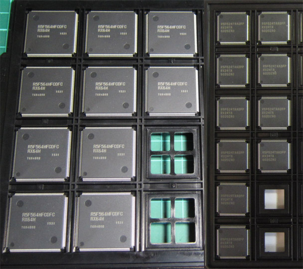

Renesas RX マイコン
=========


## RX 各ディレクトリー、及び概要など

 これはルネサス RX マイコンと、そのコンパイラである rx-elf-gcc,g++ によるプログラムです。   
   
 現在は、Windows、OS-X、Linux で動作確認が済んだ、専用書き込みプログラムも実装してあり、   
 複数の環境で、開発が出来るようになっています。   
 ※現在サポートされ、動作確認済みデバイスは RX63T、RX24T、RX64M、RX65N となっており、   
 デバイスクラスを日々拡張しています。   
 ※ディレクトリー構成など日々アップデートしており、乖離も発生するので注意下さい。   
 ※不明な点などあったら気軽にメールか、BBS にて質問を下さい。   
   
 プロジェクトは、Makefile、及び、関連ヘッダー、ソースコードからなり、専用のスタートアップ   
 ルーチン、リンカースクリプトで構成されています。   
   
 通常「make」コマンド一発で、従属規則生成から、コンパイル、リンクまで完了する為、IDE を   
 必要としません。  
 その為、専用のブートプログラムやローダーは必要なく、作成したバイナリーをそのまま ROM へ   
 書いて実行できます。   
   
 デバイスＩ／Ｏ操作では、C++ で実装されたテンプレート・クラス・ライブラリーを活用して専用の   
 ヘッダーを用意してあり、ユーティリティー的クラス・ライブラリーの充実も行っています。   
 ※一部、ルネサス製のライブラリを利用しています。   
   
## RX プロジェクト・リスト
 - /RX600              ---> RX マイコン共通デバイス定義クラス
 - /RX71M              ---> RX71M 専用のデバイス定義クラス、リンカースクリプト
 - /RX65x              ---> RX651, RX65N 専用デバイス定義クラス、リンカースクリプト
 - /RX64M              ---> RX64M 専用のデバイス定義クラス、リンカースクリプト
 - /RX63T              ---> RX63T 専用のデバイス定義クラス、リンカースクリプト
 - /RX24T              ---> RX24T 専用のデバイス定義クラス、リンカースクリプト
 - /RX621              ---> RX621 専用のデバイス定義クラス、リンカースクリプト（現在メンテ対象外）
 - /ff12b              ---> ChaN 氏作成の fatfs ソースコードと RX マイコン向け RSPI コード
 - /common             ---> 共有クラス、ヘッダーなど
 - /rxprog             ---> RX フラッシュへのプログラム書き込みツール（Windows、OS-X、Linux 対応）
 - /rx63t_chager       ---> RX63T を使ったモバイルバッテリー・チャージャー・プロジェクト（未完）
 - /rx24t_first_sample ---> RX24T を使った LED 点滅
 - /rx24t_SCI_sample   ---> RX24T を使った SCI1 の制御サンプル
 - /rx24t_SDC_sample   ---> RX24T を使った SD カードの動作サンプル
 - /rx24t_GPS_sample   ---> RX24T を使った GPS の動作サンプル
 - /rx24t_DATA_FLASH_sample ---> RX24T を使った内臓データ・フラッシュ操作サンプル
 - /rx24t_LOGGER       ---> RX24T を使ったデータロガー・プロジェクト
 - /rx64m_first_sample ---> RX64M を使った LED 点滅
 - /rx64m_SCI_sample   ---> RX64M を使った UART (SCI1) の制御サンプル
 - /rx64m_SDRAM_sample ---> RX64M を使った SDRAM の制御サンプル（128Mビット×2、32ビットバス）
 - /rx64m_RTC_sample   ---> RX64M を使った 内臓 RTC の動作サンプル
 - /rx64m_TPU_sample   ---> RX64M を使った TPU の制御サンプル（タイマー割り込み）
 - /rx64m_DMAC_sample  ---> RX64M を使った DMAC 制御のサンプル（メモリー操作）
 - /rx64m_DA_sample    ---> RX64M を使った 内臓 D/A 変換、TPU、DMAC のサンプル
 - /rx64m_AUDIO_sample ---> RX64M を使った SD カード上のオーディオファイルを内臓 D/A で再生する 
 - /GR-KAEDE_ftps      ---> ルネサス製の RX64M 搭載マイコンボード向けサンプル（FTP サーバー）
 - /GR-KAEDE_http      ---> ルネサス製の RX64M 搭載マイコンボード向けサンプル（http サーバー）
 - /RTK5_first_sample  ---> ルネサス製 RTK5RX65N マイコンボード、初期サンプル   
 - /RTK5_LCD_sample    ---> ルネサス製 RTK5RX65N マイコンボード、ＬＣＤサンプル
 - /RTK5_AUDIO_sample  ---> ルネサス製 RTK5RX65N マイコンボード、オーディオプレイヤー
 - /RTK5_SIDE          ---> ルネサス製 RTK5RX65N マイコンボード SpaceInvaders エミュレーター   

## RX 開発環境準備（Windows、MSYS2）
   
 - Windows では、事前に MSYS2 環境をインストールしておきます。
 - MSYS2 には、msys2、mingw32、mingw64 と３つの異なった環境がありますが、RX マイコン用 gcc    
   の構築を行う必要があるので、msys2 で行います。
   
 - msys2 のアップグレード

```
   pacman -Sy pacman
   pacman -Syu
```

 - コンソールを開きなおす。（コンソールを開きなおすように、メッセージが表示されるはずです）

```
   pacman -Su
```
 - アップデートは、複数回行われ、その際、コンソールの指示に従う事。
 - ※複数回、コンソールを開きなおす必要がある。

 - gcc、texinfo、gmp、mpfr、mpc、diffutils、automake、zlib、tar、make、unzip、git コマンドなどをインストール
```
   pacman -S gcc
   pacman -S texinfo
   pacman -S mpc-devel
   pacman -S diffutils
   pacman -S automake
   pacman -S zlib
   pacman -S tar
   pacman -S make
   pacman -S unzip
   pacman -S zlib-devel
   pacman -S git
```
   
---
## RX 開発環境準備（OS-X）

 - OS-X では、事前に macports をインストールしておきます。（brew は柔軟性が低いのでお勧めしません）
 - OS−X のバージョンによっては、事前に X−Code、Command Line Tools などのインストールが必要になるかもしれません）

 - macports のアップグレード

```
   sudo port -d self update
```

 - ご存知とは思いますが、OS−X では初期段階では、gcc の呼び出しで llvm が起動するようになっています。
 - しかしながら、現状では llvm では、gcc のクロスコンパイラをビルドする事は出来ません。
 - そこで、macports で gcc をインストールします、バージョンは５系を使う事とします。
```
   sudo port install gcc5
   sudo ln -sf /opt/local/bin/gcc-mp-5  /usr/local/bin/gcc
   sudo ln -sf /opt/local/bin/g++-mp-5  /usr/local/bin/g++
   sudo ln -sf /opt/local/bin/g++-mp-5  /usr/local/bin/c++
```
 - 再起動が必要かもしれません。
 - 一応、確認してみて下さい。
```
   gcc --version
```
   
```
   gcc (MacPorts gcc5 5.4.0_0) 5.4.0
   Copyright (C) 2015 Free Software Foundation, Inc.
   This is free software; see the source for copying conditions.  There is NO
   warranty; not even for MERCHANTABILITY or FITNESS FOR A PARTICULAR PURPOSE.
```
   
 - texinfo、gmp、mpfr、mpc、diffutils、automake コマンドなどをインストール
```
   sudo port install texinfo
   sudo port install gmp
   sudo port install mpfr
   sudo port install libmpc
   sudo port install diffutils
   sudo port install automake
```

---
## RX 開発環境準備（Ubuntu）

Linux 環境は、複数あるので、ここでは「Ubuntu 16.04 LTS」環境の場合を書いておきます。

 - texinfo、gmp、mpfr、mpc、diffutils、automake コマンドなどをインストール
```
   sudo apt-get install texinfo
   sudo apt-get install libgmp-dev
   sudo apt-get install libmpfr-dev
   sudo apt-get install libmpc-dev
   sudo apt-get install diffutils
   sudo apt-get install automake
   sudo apt-get install zlib1g-dev
```

---
## RX 開発環境構築

 - RX 用コンパイラ（rx-elf-gcc,g++）は gcc-6.4.0 を使います。   
 - binutils-2.30.tar.gz をダウンロードしておく。   
 - gcc-6.4.0.tar.gz をダウンロードしておく。   
 - newlib-2.4.0.tar.gz をダウンロードしておく。   
 - binutils, gcc, newlib には複数のバージョンがありますが、組み合わせによっては   
   不適格なバイナリー（微妙に動作に問題がある）がビルドされる事が判っています。   
 - この不具合は、ルネサスのネットワークスタック（net_T4）を使った場合に起こります。
 - 何故そのような動作不良を起こすのかは、原因を特定出来ていません。
 - 現状で調査した組み合わせを列挙しておきます。
```
   binutils-2.27, gcc-4.9.4, newlib-2.2.0 ---> OK
   binutils-2.27, gcc-5.5.0, newlib-2.2.0 ---> OK
   binutils-2.27, gcc-5.5.0, newlib-2.4.0 ---> OK
   binutils-2.27, gcc-6.4.0, newlib-2.4.0 ---> OK
   binutils-2.28, gcc-6.4.0, newlib-2.4.0 ---> OK
   binutils-2.30, gcc-6.4.0, newlib-2.4.0 ---> OK (current)
   binutils-2.30, gcc-6.4.0, newlib-3.0.0 ---> NG 
```
   
---
   
#### binutils-2.30 をビルド
```
   cd
   tar xfvz binutils-2.30.tar.gz
   cd binutils-2.30
   mkdir rx_build
   cd rx_build
   ../configure --target=rx-elf --prefix=/usr/local/rx-elf --disable-nls
   make
   make install     OS-X,Linux: (sudo make install)
```

 -  /usr/local/rx-elf/bin へパスを通す（.bash_profile を編集して、パスを追加）

```
   PATH=$PATH:/usr/local/rx-elf/bin
```

 -  コンソールを開きなおす。

```
   rx-elf-as --version
```

 -  アセンブラコマンドを実行してみて、パスが有効か確かめる。
  
#### C コンパイラをビルド
```
    cd
    tar xfvz gcc-6.4.0.tar.gz
    cd gcc-6.4.0
    mkdir rx_build
	cd rx_build
    ../configure --prefix=/usr/local/rx-elf --target=rx-elf --enable-languages=c --disable-libssp --with-newlib --disable-nls --disable-threads --disable-libgomp --disable-libmudflap --disable-libstdcxx-pch --disable-multilib --enable-lto
    make
    make install     OS-X,Linux: (sudo make install)
```
  
#### newlib をビルド
```
    cd
    tar xfvz newlib-2.4.0.tar.gz
	cd newlib-2.4.0
    mkdir rx_build
    cd rx_build
    ../configure --target=rx-elf --prefix=/usr/local/rx-elf
	make
    make install     OS-X: (sudo make install)
```
 - Linux 環境では、sudo コマンドで、ローカルで設定した binutils のパスを認識しないので、
「make install」が失敗します、その為、以下のようなスクリプトを書いて実行します。
```
#!/bin/sh
# file: rx_install.sh

PATH=${PATH}:/usr/local/rx-elf/bin
make install
```
   
```
    sudo rx_install.sh
```
   
---
     
#### C++ コンパイラをビルド
```
    cd
    cd gcc-6.4.0
    cd rx_build
    ../configure --prefix=/usr/local/rx-elf --target=rx-elf --enable-languages=c,c++ --disable-libssp --with-newlib --disable-nls --disable-threads --disable-libgomp --disable-libmudflap --disable-libstdcxx-pch --disable-multilib --enable-lto --with-system-zlib
    make
    make install     OS-X,Linux: (sudo make install)
```

---
   
 - ビルドしたコンパイラーコレクションを以下のリンクに上げてある。（MSYS2のみ）   
http://www.rvf-rc45.net/Renesas_GNU_Tools/ 

---
   
## RX プロジェクトのソースコードを取得

```
   git clone git://github.com/hirakuni45/RX.git
```
   
--- 
   
## RX デバイスへのプログラム書き込み方法

幾つかの方法がありますが、最も簡単で、コストがかからない方法は、シリアルインターフェースを使って   
書き込む方法です。   
USB インターフェース内臓の RX マイコンの場合は、USB でブートして接続する事もできますが、ドライバー   
は、Windows 版しか対応しないようです。（この辺りの事情は詳しく調査していない為間違っているかもしれません）   
   
また、全ての RX マイコンが USB インターフェースを内臓しているわけでは無い為、もっとも一般的な、   
シリアルインターフェースを使って書き込む方法を紹介します。   
   
※シリアルポートとの接続、ブートモードへの切り替えについては、ハードウェアマニュアルに書かれていま   
すので参考にして下さい。   
通常、ＭＤ端子を、Ｌ又はＨにする事で、プログラムと内臓ＲＯＭの実行を切り替えできます。   
   
※USB シリアル変換モジュールなどを使うと、電源も取れて簡単です。   
※（秋月電子、シリアル変換モジュール）http://akizukidenshi.com/catalog/g/gK-06894/   
※（CP2102 シリアル変換モジュール）https://www.amazon.co.jp/%E3%80%90%E3%83%8E%E3%83%BC%E3%83%96%E3%83%A9%E3%83%B3%E3%83%89%E5%93%81%E3%80%91USB%E2%86%92TTL-%E3%82%B3%E3%83%B3%E3%83%90%E3%83%BC%E3%82%BF%E3%83%BC%E3%83%A2%E3%82%B8%E3%83%A5%E3%83%BC%E3%83%AB-%E3%82%A2%E3%83%80%E3%83%97%E3%82%BF%E3%83%BC-CP2102-%E3%82%B7%E3%83%AA%E3%82%A2%E3%83%AB%E5%A4%89%E6%8F%9B/dp/B008RF73CS/ref=sr_1_1?ie=UTF8&qid=1477589109&sr=8-1&keywords=%EF%BD%83%EF%BD%90%EF%BC%92%EF%BC%91%EF%BC%90%EF%BC%92
(1) RXD シリアル受信   
(2) TXD シリアル送信   
(3) VCC 電源（５Ｖ又は３．３Ｖ）   
(4) GND 電源 ０Ｖ   
※３．３Ｖは限られた電流しか取り出せない為、必ずレギュレーターが必要です。   
※中国製の格安なモジュールは、品質が安定していない為、お勧めしません、それらの事   
項を理解していて対処出来る人だけ利用すると良いと思います。   
   
 - 接続方法、ブートモードの設定などは、各デバイスのハードウェアー・マニュアルに詳細があります。   
   
## RX フラッシュプログラマーの構築

 - 現在、RX63T、RX24T、RX64M へのフラッシュ書き込みを確認しています。
 - リセットは、制御していないので、書き込み時にリセット信号をアサートする必要があります。
 - 現在のバージョンでは、消去、書き込み、比較 の動作のみ実装されています。
 - コードプロテクトの ID 設定や比較などは未実装です。
 - RX24T、RX63T では、接続が確立した時に、消去が自動で行われる為、消去動作は無視されます。
 - rx_prog のビルドには「boost」が必要です。（通常最新バージョンを使う）
 - boost はヘッダーのみ利用なので、ビルドの必要はありません。
 - mingw64 環境などに pacman を使い boost をインストールして使っています。

``` 
    pacman -S mingw-w64-x86_64-boost   
```

 - rxprog のビルド（MSYS2）
 - ビルドした実行ファイルは、/usr/local/bin に配置します。

```
    cd rxprog
    make
    make install
　　※/usr/local/bin にパスを通しておく。
```
 - rx_prog.conf を編集して、接続する COM ポート、ボーレートの設定をする。
 - /dev/ttyS10 -> COM11 に相当します。（数字に＋１する）
 - 「rx_prog.conf」には、標準のシリアルポートを記述できます、自分の環境に合わせて設定しておくと良いでしょう。
 - ポートの設定は、開発環境の違いに対応できるように、Windows、OS-X、Linux と環境別のポートを設定できます。
 - 各プロジェクトの「Makefile」には、「make run」で書き込めるスクリプトが設定されています。
   
---
   
## Renesus ENVISION KIT-RX65N を使った開発


 - ルネサスが販売する「RTK5RX65N」は、LCD 付きでありながら低価格で高機能なボードです。   
 - もちろんラズベリーPiなどとは比較はできませんが、スタンドアロンで動かす事の出来る手頃なマイコンボードだと思えます。
 - また、このボードには、「E1 Lite エミュレーター」が内臓されており、USB 接続で、簡単にプログラムを書き込む事が出来ます。（Windows 環境で、Renesus Flash Programmer を使って書き込める）
 - DIP SW 1, 1 を「ON」にする事で、内臓エミュレーターが有効になり、「Renesas Flash Programmer」
   で書き込めます。   
 - 初期状態では、SD カード、イーサーネット関係の部品などが抜けていますが、後から自分で取り付ける事が出来ると思います。
 - このボード標準の SD カードソケットは、製造が終了しており、また日本では、入手製が困難
   で、価格も高い為、別の方法を推奨します。
 - 秋月電子製のマイクロ SD ソケットアダプタを介して接続するのが簡単です。   
      
---
      
License
----

MIT
